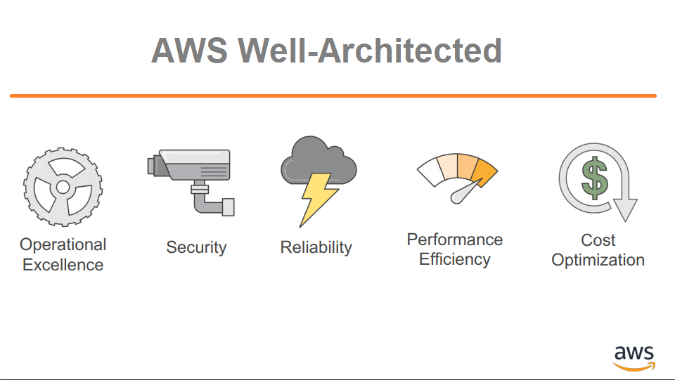

## Module 1: Architecting Fundamentals

A seção a seguir fornece informações sobre componentes da infraestrutura global da AWS, serviços da AWS e práticas recomendadas de arquitetura — os conceitos fundamentais necessários para a arquitetura na AWS. Para saber mais sobre uma categoria, escolha cada uma das quatro guias a seguir.

## Resources

### AWS infrastructure

- [AWS re:Invent 2019: Innovation and operation of the AWS global network infrastructure (NET339)](https://www.youtube.com/watch?v=UObQZ3R9_4c) (vídeo (58 min. 36 sec.))

- [Leveraging AWS Global Backbone for Data Center Migration and Global Expansion](https://aws.amazon.com/blogs/architecture/leveraging-aws-global-backbone-for-data-center-migration-and-global-expansion/) (Blog)
- [Building a Self-Service, Secure, and Continually Compliant Environment on AWS](https://aws.amazon.com/blogs/architecture/building-a-self-service-secure-continually-compliant-environment-on-aws/) (Blog)

### AWS services

- [Getting Started with SDKs](https://www.youtube.com/watch?v=qKJ5U1ETDJI) (video 3 min. 41 sec.)

- [Building Your Hybrid Cloud Strategy with AWS](https://pages.awscloud.com/rs/112-TZM-766/images/Building-Your-Hybrid-Cloud-Strategy-eBook.pdf) (Whitepaper)
- [How to Accelerate Your WordPress Site with Amazon CloudFront](https://aws.amazon.com/blogs/startups/how-to-accelerate-your-wordpress-site-with-amazon-cloudfront/) (Blog)
- [Infrastructure as Code Testing Strategies with AWS CloudFormation](https://www.youtube.com/watch?v=JSfqUCIK_OA) (Video)

### Securing resources

- [Maximizing Security: Shared Responsibility Model](https://www.youtube.com/watch?v=hWq5DIyk_Y8) (vídeo 7 min. 32 sec.)

- [Applying the AWS Shared Responsibility Model to your GxP Solution](https://aws.amazon.com/blogs/industries/applying-the-aws-shared-responsibility-model-to-your-gxp-solution/) (Blog)

### Well-Architected Framework

- [AWS On Air WWPS Summit 2022 ft. Maximizing the Benefit of AWS Well Architected Review](https://www.youtube.com/watch?v=UczdYkCJV18) (vídeo 18 min. 32 sec.)

- [AWS Well Architected Framework: Best Practices for Building and Deploying an Optimized Cloud Environment](https://aws.amazon.com/blogs/publicsector/aws-well-architected-framework-best-practices-for-building-and-deploying-an-optimized-cloud-environment/) (Blog)
- [Are You Well-Architected?](https://www.youtube.com/watch?v=gjNPpjYNiow) (Video)
- [Security Best Practices the Well Architected Way](https://www.youtube.com/watch?v=vqvdMvqs82M)(Video)
- [AWS Summit Brussels 2022 - AWS Well-Architected Framework for Sustainability](https://www.youtube.com/watch?v=IHJkbg3jqVg) (Video)