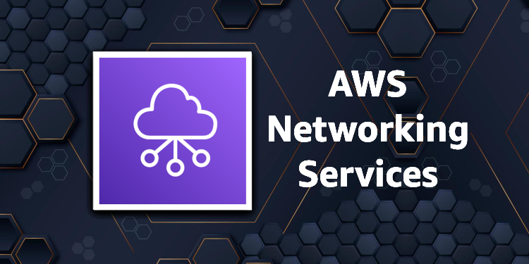

## Module 3: Networking 1

A seção a seguir fornece mais informações sobre os elementos necessários para criar uma rede virtual elástica e segura, abrangendo endereçamento IP, fundamentos da nuvem privada virtual (VPC) e conceitos de segurança de tráfego VPC. Para saber mais sobre uma categoria, escolha cada uma das três guias a seguir.

## Network ACL use case

A lista de controle de acesso à rede (ACL) controla o acesso a instâncias em uma sub-rede e atua como uma camada de defesa de backup. As regras da Network ACL se aplicam a todas as instâncias na sub-rede.

No exemplo, as instâncias em sua sub-rede podem se comunicar entre si e podem ser acessadas de um computador remoto confiável. O computador remoto pode ser um computador em sua rede local ou uma instância em uma sub-rede ou VPC diferente. Você o usa para se conectar às suas instâncias para executar tarefas administrativas.

> Accessibility notes - Uma região contém uma VPC com intervalo de Classless Inter-Domain Routing (CIDR) 10.0.0.0/16. A VPC abrange uma zona de disponibilidade denominada zona de disponibilidade. Uma sub-rede pública com intervalo CIDR 10.0.1.0/24 é colocada dentro da zona de disponibilidade. Uma caixa de grupo de segurança envolve várias instâncias. Uma linha conecta um cliente com IP 172.31.1.2/32 com a caixa de grupo de segurança. Outra linha se conecta a uma descrição do security group sg-1a2b3c4d. Entrada, permita todo o tráfego de sg-1a2b3c4d. Permitir tráfego Secure Shell (SSH) de 172.31.1.2/32. Saída, permita todo o tráfego de sg-1a2b3c4d. Uma caixa chamada 'network acl-11223344' está conectada à zona de disponibilidade. Entrada, regra número 100: SSH 172.31.1.2/32 PERMITIR. Número da regra *: Todo o tráfego 0.0.0.0/0 DENY. Saída, número da regra 100: Custom TCP 172.31.1.2/32 PERMITIR. Número da regra *: Todo o tráfego 0.0.0.0/0 DENY.

As regras do grupo de segurança e as regras da Network ACL permitem o acesso a partir do endereço IP do seu computador remoto (172.31.1.2/32). Todo o outro tráfego da Internet ou de outras redes é negado.

Para obter mais informações, visite [Control Traffic to Subnets Using Network ACLs](https://docs.aws.amazon.com/vpc/latest/userguide/vpc-network-acls.html) no Amazon Virtual Private Cloud User Guide.

## Resources

- [AWS Networking Fundamentals](https://www.youtube.com/watch?v=hiKPPy584Mg) (Video)

### IP addressing

- [Demystifying VPC IP Addressing & Creating a Complete Routing Solution ](https://youtu.be/rvJMCdjSZxU) (vídeo 54 min. 48 sec.)

- [VPCs and Subnets](https://docs.aws.amazon.com/vpc/latest/userguide/how-it-works.html#how-it-works-subnet) (AWS documentation)

- [How Do I Modify the IPv4 CIDR Block of My Amazon VPC?](https://aws.amazon.com/premiumsupport/knowledge-center/vpc-ip-address-range/) (AWS documentation)

- [Bring Your Own IP Address to the Cloud](https://www.youtube.com/watch?v=6G54JaQq5Go) (Video)

### VPC fundamentals

- [VPC Fundamentals and Connectivity Options](https://youtu.be/jZAvKgqlrjY) (vídeo 50 min. 50 sec.)

- [One to Many: Evolving VPC Design](https://aws.amazon.com/blogs/architecture/one-to-many-evolving-vpc-design/) (AWS Architecture Blog)

- [VPC Sharing: Key Considerations and Best Practices](https://aws.amazon.com/blogs/networking-and-content-delivery/vpc-sharing-key-considerations-and-best-practices/) (AWS Networking and Content Delivery)

- [Field Notes: Launch Amazon EMR with a Static Private IP in a Private Subnet](https://aws.amazon.com/blogs/architecture/field-notes-launch-amazon-emr-with-a-static-private-ip-in-a-private-subnet/) (AWS Architecture Blog)

- [Advanced VPC Design and New Capabilities for Amazon VPC](https://www.youtube.com/watch?v=tkaMmFoWwaA) (Video, AWS re:Invent 2020)

- [Secure Your Workloads with NAT Gateway](https://www.youtube.com/watch?v=SwZoQZi-eYk) (Video)

### VPC traffic security

- [VPC Traffic Mirroring – Capture & Inspect Network Traffic](https://aws.amazon.com/blogs/aws/new-vpc-traffic-mirroring/) (AWS News Blog)