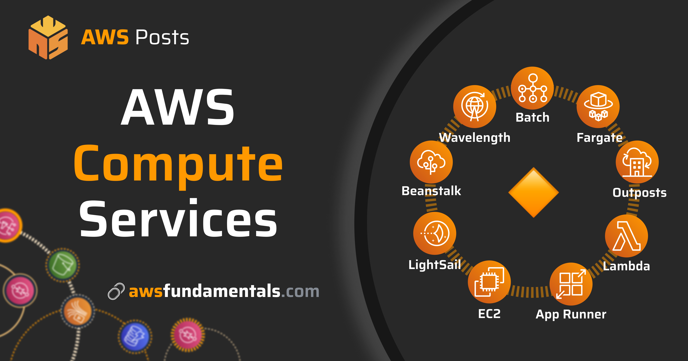

## Module 4: Compute

A seção a seguir fornece informações sobre opções de definição de preço de computação de alto desempenho (HPC), AWS Lambda e Amazon Elastic Compute Cloud (Amazon EC2). Para saber mais, escolha cada uma das duas guias a seguir.

## Resources

### High performance computing

- [AWS re:Invent 2020: HPC on AWS: Innovating Without Infrastructure Constraints ](https://youtu.be/Us9ZGtzZRk8) (vídeo 23 min. 58 sec.)

- [FORMULA 1 Transfers Race Car Data into AWS Using AWS DataSync](https://aws.amazon.com/blogs/storage/formula-1-transfers-race-car-data-into-the-aws-cloud-using-aws-datasync/) (Blog)

- [Enabling Job Accounting for HPC with AWS ParallelCluster and Amazon RDS](https://aws.amazon.com/blogs/compute/enabling-job-accounting-for-hpc-with-aws-parallelcluster-and-amazon-rds/) (Blog)

- [Orchestrating an Application Process with AWS Batch Using AWS CloudFormation](https://aws.amazon.com/blogs/compute/orchestrating-an-application-process-with-aws-batch-using-aws-cloudformation/) (Blog)

### AWS Lambda

- [AWS re:Invent 2019: Serverless Architectural Patterns and Best Practices ](https://youtu.be/9IYpGTS7Jy0) (vídeo 1 hr. 3 min. 34 sec.) 

- [Issues to Avoid When Implementing Serverless Architecture with AWS Lambda](https://aws.amazon.com/blogs/architecture/mistakes-to-avoid-when-implementing-serverless-architecture-with-lambda/) (Blog)
    
- [Introducing Amazon S3 Object Lambda – Use Your Code to Process Data as It Is Being Retrieved from S3](https://aws.amazon.com/blogs/aws/introducing-amazon-s3-object-lambda-use-your-code-to-process-data-as-it-is-being-retrieved-from-s3/) (Blog)
    
- [Building Microservices with AWS Lambda](https://www.youtube.com/watch?v=TOn0xhev0Uk) (Video)
    
- [AWS Lambda Under the Hood](https://www.youtube.com/watch?v=xmacMfbrG28) (Video)

### Amazon EC2 pricing options

- [Savings Plans FAQ](https://aws.amazon.com/savingsplans/faq/?nc1=h_ls) (AWS Documentation)

- [Save Up to 90% and Run Production Workloads on Spot Instances](https://www.youtube.com/watch?v=7q5AeoKsGJw) (Video)