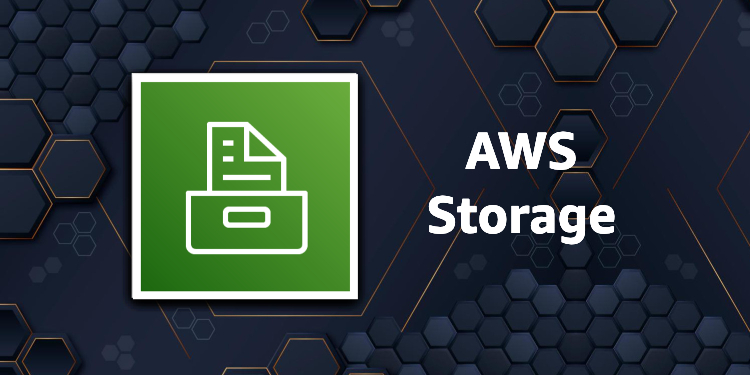
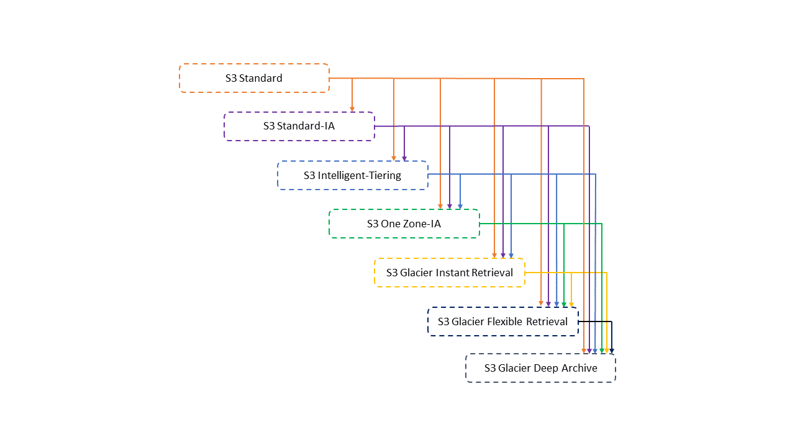
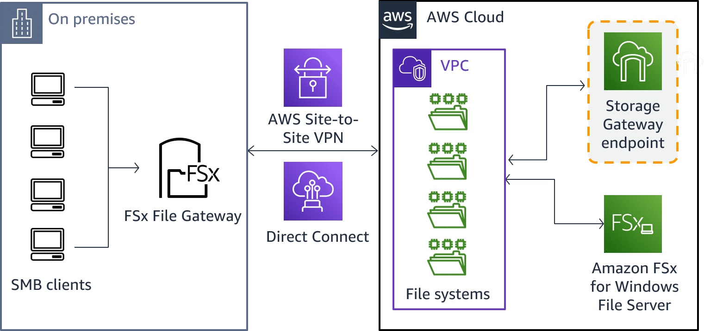
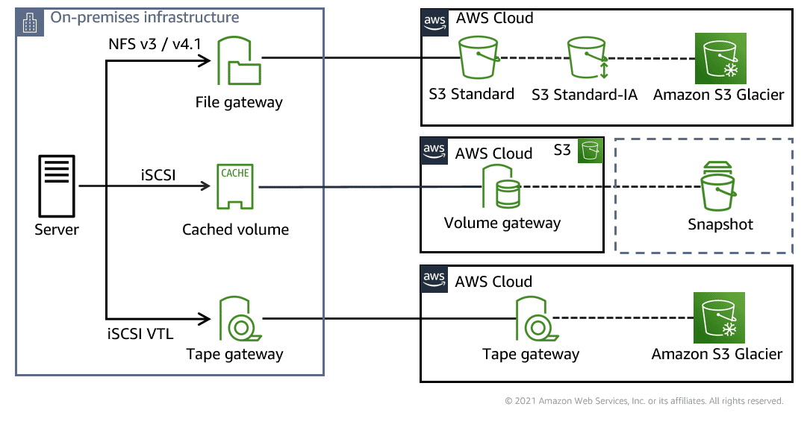

## Module 5: Storage

A seção a seguir fornece mais informações sobre soluções de armazenamento em uma arquitetura. Revise mais informações sobre como usar serviços de armazenamento, Amazon Simple Storage Service (Amazon S3), sistemas de arquivos compartilhados e AWS DataSync em suas arquiteturas. Para saber mais, escolha cada uma das quatro guias a seguir.

## Resources

### Amazon S3 Lifecycle configuration

O Amazon S3 oferece suporte a um modelo em cascata para fazer a transição entre as classes de armazenamento. [A configuração do ciclo de vida do S3](https://docs.aws.amazon.com/AmazonS3/latest/userguide/lifecycle-transition-general-considerations.html) altera automaticamente as camadas de armazenamento de dados. Para revisar o modelo em cascata para fazer a transição entre as classes de armazenamento, escolha cada um dos cinco marcadores numerados.

O Amazon S3 oferece suporte às seguintes transições de ciclo de vida entre classes de armazenamento usando uma configuração de ciclo de vida do S3:
- A classe de armazenamento S3 Standard para qualquer outra classe de armazenamento

- Qualquer classe de armazenamento para as classes de armazenamento S3 Glacier Flexible Retrieval ou S3 Glacier Deep Archive

- A classe de armazenamento S3 Standard-IA para as classes de armazenamento S3 Intelligent-Tiering, S3 One Zone-IA ou S3 Glacier Instant Retrieval

- A classe de armazenamento S3 Intelligent-Tiering para a classe de armazenamento S3 One Zone-IA

- A classe de armazenamento S3 Glacier Flexible Retrieval para a classe de armazenamento S3 Glacier Deep Archive

### Amazon FSx File Gateway solution

Você pode mover sistemas de arquivos locais do Windows para a nuvem. O Amazon FSx File Gateway fornece uma conexão eficiente e de baixa latência. Isso beneficia os usuários que experimentam latências mais altas e largura de banda compartilhada ou limitada entre suas instalações e a nuvem.

Muitos aplicativos de desktop locais e cargas de trabalho são sensíveis à latência. Isso pode levar a um desempenho mais lento ao acessar arquivos diretamente de locais remotos. O FSx File Gateway otimiza seu acesso local mantendo um cache local de dados acessados ​​com frequência. Para saber mais sobre como acessar o armazenamento em nuvem, visite este blog do AWS Storage em [Cloud Storage in Minutes with AWS Storage Gateway](https://aws.amazon.com/blogs/storage/cloud-storage-in-minutes-with-aws-storage-gateway-updated/)

### AWS Storage Gateway modes

Além do protocolo NFS v3 e v4.1, o serviço AWS Storage Gateway adicionou o protocolo Server Message Block (SMB) ao File Gateway. Portanto, os aplicativos baseados em arquivo desenvolvidos para o Microsoft Windows podem armazenar e acessar objetos no Amazon S3.

Para obter mais informações sobre o AWS Storage Gateway, consulte a postagem [AWS Storage Gateway adiciona suporte SMB para armazenar e acessar objetos em baldes do Amazon S3](https://aws.amazon.com/about-aws/whats-new/2018/06/aws-storage-gateway-adds-smb-support-to-store-objects-in-amazon-s3/).

## Resources

### Storage Services

- [AWS Storage Day 2020](https://youtu.be/qlAw07o5l00) (vídeo 20 min. 7 sec.)

- [AWS Storage – EBS vs S3 vs EFS](https://www.youtube.com/watch?v=6vNC_BCqFmI) (Video)

- [Comparing Your On-Premises Storage Patterns with AWS Storage Services](https://aws.amazon.com/blogs/storage/comparing-your-on-premises-storage-patterns-with-aws-storage-services/) (Blog)

- [Storage Options and Designs for VMware Cloud on AWS – Direct Attached Storage](https://aws.amazon.com/blogs/storage/storage-options-and-designs-for-vmware-cloud-on-aws/) (Blog)

### Amazon S3

- [AWS re:Invent 2019: [REPEAT] Best practices for Amazon S3 (including storage classes) (STG302-R)](https://youtu.be/N_3IaOVcIO0) (vídeo 55 min. 23 sec.) 

- [S3 Encryption and Networking with S3 PrivateLink and S3 Bucket Keys](https://www.youtube.com/watch?v=qvXEJwnJXRA) (Video)

- [Amazon S3 Block Public Access – Another Layer of Protection for Your Accounts and Buckets](https://aws.amazon.com/blogs/aws/amazon-s3-block-public-access-another-layer-of-protection-for-your-accounts-and-buckets/) (Blog)

- [Changing Your Amazon S3 Encryption from S3-Managed to AWS KMS](https://aws.amazon.com/blogs/storage/changing-your-amazon-s3-encryption-from-s3-managed-encryption-sse-s3-to-aws-key-management-service-sse-kms/) (Blog)

### Shared file systems

- [Amazon FSx for Windows File Server](https://youtu.be/IMDWTIShlyI) (vídeo 14 min. 22 sec.) 

- [Get Started Using Amazon FSx File Gateway for Fast, Cached Access to File Server Data in the Cloud](https://aws.amazon.com/blogs/aws/get-started-using-amazon-fsx-file-gateway-for-fast-cached-access-to-file-server-data-in-the-cloud/) (Blog)

- [What's New with Amazon FSx](https://www.youtube.com/watch?v=Fm_aaDdROyk) (Video)

- [High-Performance HDD Storage for Amazon FSx for Lustre File Systems](https://aws.amazon.com/blogs/aws/new-high-performance-hdd-storage-for-amazon-fsx-for-lustre-file-systems/) (Blog)

- [Windows Home Directories Made Easy with Amazon FSx](https://aws.amazon.com/blogs/storage/windows-home-directories-and-file-shares-made-easy-with-amazon-fsx/) (Blog)

- [Using Microsoft Windows File Shares](https://docs.aws.amazon.com/fsx/latest/WindowsGuide/using-file-shares.html) (Blog)

- [Creating and Activating File Gateway on VMware](https://aws.amazon.com/blogs/storage/creating-and-activating-aws-file-gateway-on-vmware/) (Blog)

### AWS Data Sync

- [AWS DataSync Demo - Easily Transfer Data to and From AWS Up to 10x Faster](https://youtu.be/_qhTF-gB-JE) (vídeo 5 min. 30 sec.)