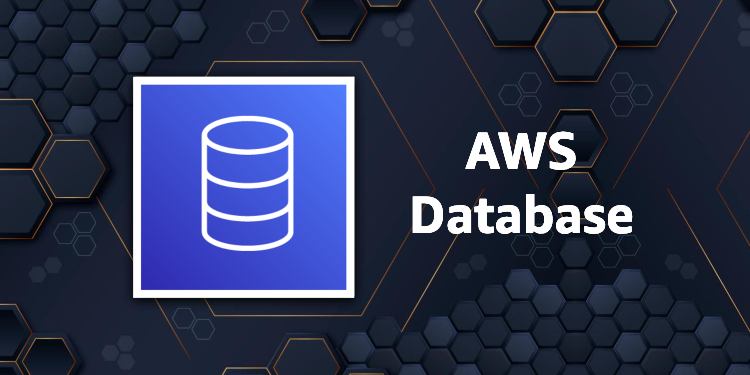

## Module 6: Database Services

A seção a seguir fornece informações sobre Amazon Relational Database Service (Amazon RDS), Amazon DynamoDB e Amazon Redshift, bem como cache de banco de dados e ferramentas de migração de banco de dados.

- [Building for the Future with AWS Databases](https://youtu.be/7OI3C7TwW64) (vídeo 44 min. 12 sec.) 

## Resources

### Amazon RDS

- [Amazon Relational Database Service (Amazon RDS)](https://youtu.be/igRfulrrYCo) (vídeo 1 hr. 3 min. 17 sec. )

- [Implementing a Disaster Recovery Strategy with Amazon RDS](https://aws.amazon.com/blogs/database/implementing-a-disaster-recovery-strategy-with-amazon-rds/) (Blog)

### Amazon DynamoDB

- [AWS re:Invent 2019: Data Modeling with Amazon DynamoDB](https://youtu.be/DIQVJqiSUkE) (vídeo 39 min. 46 sec.)

- [Build with DynamoDB | S1 E1 – Intro to Amazon DynamoDB](https://www.youtube.com/watch?v=W3S1OnDqWl4) (Blog)

### Amazon Aurora

- [Amazon Aurora Under the Hood](https://aws.amazon.com/jp/blogs/database/amazon-aurora-under-the-hood-quorum-and-correlated-failure/) (Blog)

### Amazon Redshift

- [Getting Started with Amazon Redshift](https://youtu.be/dfo4J5ZhlKI) ( vídeo 46 min. 38 sec.) 

- [Deep Dive and Best Practices for Amazon Redshift](https://www.youtube.com/watch?v=lj8oaSpCFTc) (Video)

- [Top 10 Performance Tuning Techniques for Amazon Redshift](https://aws.amazon.com/blogs/big-data/top-10-performance-tuning-techniques-for-amazon-redshift/) (Blog)

- [Automate Amazon Redshift Cluster Creation Using AWS CloudFormation](https://aws.amazon.com/blogs/big-data/automate-amazon-redshift-cluster-creation-using-aws-cloudformation/) (Blog)

### Database Caching

- [Heimdall Data: Query Caching Without Code Changes](https://youtu.be/OWLGK-eVrTw) (vídeo 3 min. 36 sec.)

- [Automated Query Caching into Amazon ElastiCache for Amazon RDS, Amazon Aurora and Amazon Redshift](https://aws.amazon.com/blogs/database/automating-sql-caching-for-amazon-elasticache-and-amazon-rds/) (Blog)
 
- [Caching for Performance with Amazon DocumentDB and Amazon ElastiCache](https://aws.amazon.com/blogs/database/caching-for-performance-with-amazon-documentdb-and-amazon-elasticache/) (Blog)

- [Database Caching Strategies Using Redis](https://docs.aws.amazon.com/whitepapers/latest/database-caching-strategies-using-redis/database-caching-strategies-using-redis.pdf) (Whitepaper)

### Database Migration Tools

- [AWS Database Migration Service (AWS DMS)](https://youtu.be/zb4GcjEdl8U) ( vídeo 1 hr. 49 sec.)

- [Top 10 Data Migration Best Practices](https://www.youtube.com/watch?v=i0-pSHQJ7pA) (Video)

- [Standardizing Database Migrations with AWS Database Migration Service and AWS Service Catalog](https://aws.amazon.com/blogs/mt/standardizing-database-migrations-with-aws-database-migration-service-and-aws-service-catalog/) (Blog)