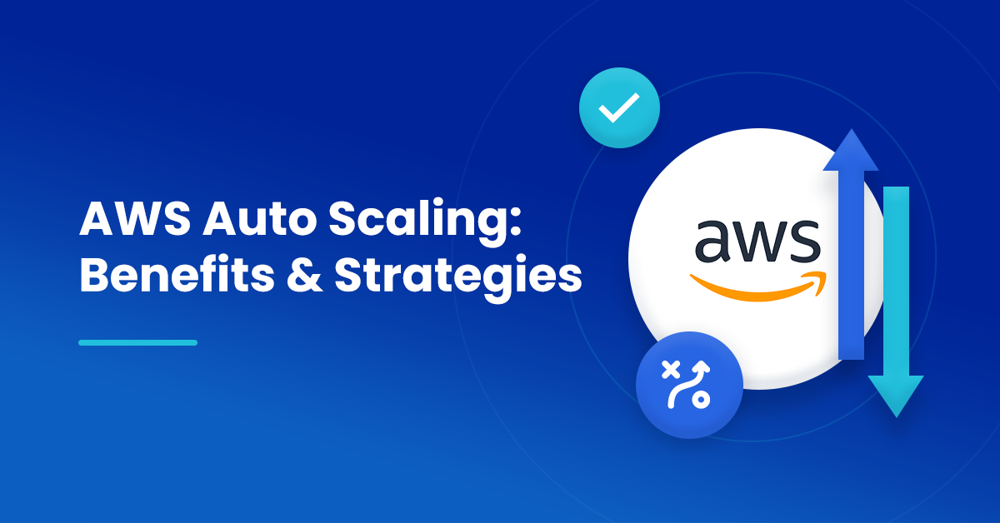

## Module 7: Monitoring and Scaling

A seção a seguir fornece informações sobre monitoramento, balanceamento de carga e dimensionamento automático do Amazon CloudWatch.

- [Monitoring Performance with CloudWatch Dashboards – AWS Virtual Workshop](https://youtu.be/_eWaPVski6o) (vídeo 1 hr. 26 min. 16 sec.)

- [Elastic Load Balancing: Deep Dive and Best Practices]() (vídeo 1 hr. 15 min.)

- [Capacity Management Made Easy with Amazon EC2 Auto Scaling](https://youtu.be/9BlsFNBnKHc) (vídeo 52 min. 50 sec.)

## Resources

### Monitoring

- [How Amazon CloudWatch Works](https://docs.aws.amazon.com/AmazonCloudWatch/latest/monitoring/cloudwatch_architecture.html) (User guide)
    
- [Amazon CloudWatch Concepts](https://docs.aws.amazon.com/AmazonCloudWatch/latest/monitoring/cloudwatch_concepts.html) (User guide)

- [Creating Metrics from Log Events Using Filters](https://docs.aws.amazon.com/AmazonCloudWatch/latest/logs/MonitoringLogData.html) (User guide)

- [Monitor Resource Changes with Amazon CloudWatch Events](https://www.youtube.com/watch?v=-rQku_AeN_Y) (Video)

### Load Balancing

- [Get the Most from Elastic Load Balancing for Different Workloads](https://www.youtube.com/watch?v=HKh54BkaOK0) (Video)

- [Building with AWS PrivateLink, Gateway Load Balancer, and AWS Partners](https://www.youtube.com/watch?v=09Fvr796SVQ) (Video)
    
- [AWS Elastic Load Balancer Demonstrations](https://mv.exampleloadbalancer.net/) (Demos)
### Auto Scaling

- [Scaling Up to Your First 10 Million Users](https://www.youtube.com/watch?v=kKjm4ehYiMs) (Video)